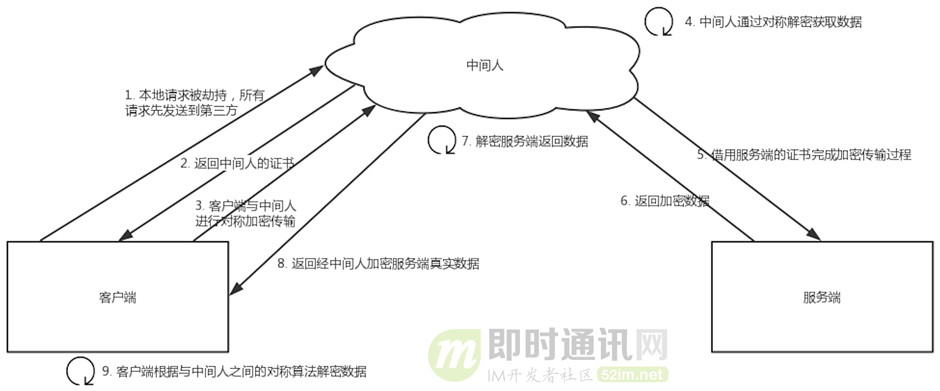

1、为什么数据传输是用对称加密？
首先：非对称加密的加解密效率是非常低的，而 http 的应用场景中通常端与端之间存在大量的交互，非对称加密的效率是无法接受的。
另外：在 HTTPS 的场景中只有服务端保存了私钥，一对公私钥只能实现单向的加解密，所以 HTTPS 中内容传输加密采取的是对称加密，而不是非对称加密。

2、为什么需要 CA 认证机构颁发证书？
HTTP 协议被认为不安全是因为传输过程容易被监听者勾线监听、伪造服务器，而 HTTPS 协议主要解决的便是网络传输的安全性问题。
首先我们假设不存在认证机构，任何人都可以制作证书，这带来的安全风险便是经典的“中间人攻击”问题。
“中间人攻击”的具体过程如下：

如上图所以，过程原理如下：
1）本地请求被劫持（如DNS劫持等），所有请求均发送到中间人的服务器；
2）中间人服务器返回中间人自己的证书；
3）客户端创建随机数，通过中间人证书的公钥对随机数加密后传送给中间人，然后凭随机数构造对称加密对传输内容进行加密传输；
4）中间人因为拥有客户端的随机数，可以通过对称加密算法进行内容解密；
5）中间人以客户端的请求内容再向正规网站发起请求；
6）因为中间人与服务器的通信过程是合法的，正规网站通过建立的安全通道返回加密后的数据；
7）中间人凭借与正规网站建立的对称加密算法对内容进行解密；
8）中间人通过与客户端建立的对称加密算法对正规内容返回的数据进行加密传输；
9）客户端通过与中间人建立的对称加密算法对返回结果数据进行解密。
由于缺少对证书的验证，所以客户端虽然发起的是 HTTPS 请求，但客户端完全不知道自己的网络已被拦截，传输内容被中间人全部窃取。

3、浏览器是如何确保 CA 证书的合法性？
【1】证书包含什么信息？
1）颁发机构信息；
2）公钥；
3）公司信息；
4）域名；
5）有效期；
6）指纹；
7）......
【2】证书的合法性依据是什么？
1）首先：权威机构是要有认证的，不是随便一个机构都有资格颁发证书，不然也不叫做权威机构；
2）另外：证书的可信性基于信任制，权威机构需要对其颁发的证书进行信用背书，只要是权威机构生成的证书，我们就认为是合法的。
所以权威机构会对申请者的信息进行审核，不同等级的权威机构对审核的要求也不一样，于是证书也分为免费的、便宜的和贵的。

4、浏览器如何验证证书的合法性？
浏览器发起 HTTPS 请求时，服务器会返回网站的 SSL 证书，浏览器需要对证书做以下验证：
1）验证域名、有效期等信息是否正确：证书上都有包含这些信息，比较容易完成验证；
2）判断证书来源是否合法：每份签发证书都可以根据验证链查找到对应的根证书，操作系统、浏览器会在本地存储权威机构的根证书，利用本地根证书可以对对应机构签发证书完成来源验证（如下图所示）：
3）判断证书是否被篡改：需要与 CA 服务器进行校验；
4）判断证书是否已吊销：通过CRL（Certificate Revocation List 证书注销列表）和 OCSP（Online Certificate Status Protocol 在线证书状态协议）实现，其中 OCSP 可用于第3步中以减少与 CA 服务器的交互，提高验证效率。
以上任意一步都满足的情况下浏览器才认为证书是合法的。
